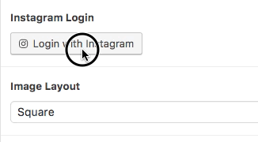
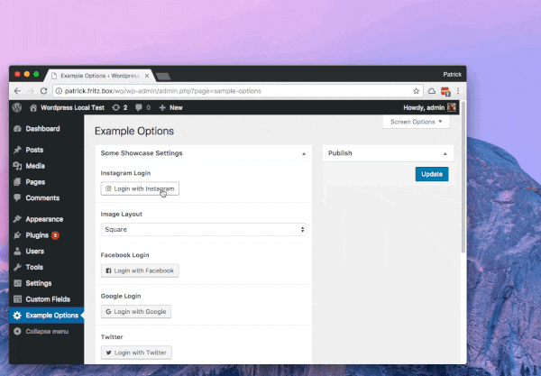

# ACF OAuth Field


An Advanced Custom Field Plugin for the OAuth Authentication Flow. It allows you to easily collect API Credentials for your users. You only have to care about your API, not about ACF.



-----------------------


### Description

ACF OAuth adds a new field type to ACF. You can choose from a list of Services that support the OAuth Protocol. ACF OAuth will add a login button to your forms.




### Compatibility

This ACF field type is compatible with:
* ACF 5
* OAuth 2.0 Webserver Flow
* OAuth 1.0a Webserver Flow

### Installation

1. Copy the `acf-oauth` folder into your `wp-content/plugins` folder
2. Activate the OAuth plugin via the plugins admin page
3. Create a new field via ACF and select the OAuth type
4. Please refer to the description for more info regarding the field type settings
5. Make sure to configure every required Service by providing the required Credentials
6. Make sure to read the _Recommended ways to improve Security_ on this page


### How to configure a Service

1. Go to your Service and **register** for an **APP** and/or **Developer Account**
2. Get your APP or Developer Credentials. Usually **Client ID** and **Client Secret**
3. Provide the **App Credentials** by extending a Service (recommended) or via Filter like in the following example

```php

add_filter( 'acf-oauth/service/instagram/appcredentials', function( $appcredentials ) {

  return array(
    'client_id'     => '1234...4321',
    'client_secret' => '4321...1234'
  );

});

```

-----------------------

## Built-In OAuth Services

Currently the following Services are supported on a minimum level. This means they request only the minimum privileges from the Service.

* Instagram *[( Requirements )](services/instagram/readme.md)*
* Facebook *[( Requirements )](services/facebook/readme.md)*
* Google *[( Requirements )](services/google/readme.md)*
* Twitter *[( Requirements )](services/twitter/readme.md)*
* Pinterest *[( Requirements ) ](services/pinterest/readme.md)*

---------------------

## How to use the field data

This depends on the service you want to use. You can view a simple Example for the Instagram Service [here](services/instagram/readme.md)

---------------------

## How to create a new Service Plugin

To get started, you can copy the Service Template Plugin from `/service-template`. It contains all required Information for implementing a new Service.

If you need to replace more of the default functionality, have a look at the Service Class in `service-class.php`

#### Minimal Service Class

That's how a simple Service implementation could look like, nothing more.

```php
final class acf_oauth_service_instagram extends acf_oauth_service {


  function __construct() {

    $this->name = 'instagram';

    $this->label = __( 'Instagram', 'acf-oauth' );

    $this->request_url_base = 'https://api.instagram.com/oauth/authorize/';

    $this->exchange_url_base = 'https://api.instagram.com/oauth/access_token';

    // a random key
    $this->cryptkey = 'B2>.]k6Jk%trz-6LB+WaV0OhmfZ!+ErM#cVc/2%!G&qE:`3r`SR9dKeFyf<}-g1*';


    parent::__constuct();

  }

  function vcard( $no_vcard, $credentials  ) {

    if( $credentials == 'working' ) {

      ...

      return '';
    }
    return $no_vcard;
  }

}
```


------------
## Recommended ways to improve Security

The created Credentials are basically stored encrypted in your Database. You can make it harder to decrypt Credentials by following these Tips.

Lastly, I would like to mention that you can't hide your data from other Plugins on your Website. Every Plugin that can access server-side data is generally able to reproduce your Encryptionkeys.

#### 1. Define ACF_OAUTH_KEY

Add the following line to your `wp-config.php`. This will make your encrypted Credentials depend on your current Wordpress installation.
After you add or modify this constant, your existing login data can no longer be decrypted. If not present ACF OAuth will use the AUTH_KEY constant for this.

__Warning:__ Make sure to replace the value by your own custom string. You can generate a random string [here](https://api.wordpress.org/secret-key/1.1/salt/).

```php

define( 'ACF_OAUTH_KEY', '&+H0lUF|=_H+iQ4+En(3da?]n;1VQzJj1$>iv0j4=i}sPD9y^Yf;iYw7HZ!L6&4q' );

```

#### 2. Offer your App Credentials directly

If you want to use a Built-In Service, you have to provide your App Credentials via filter. This makes your App Credentials public to any script that executes the same filter. A better approach is extending an existing Service and offering your App Credentials directly


```php

final class my_service extends acf_oauth_service_instagram {

  function __construct() {

    ...

    $this->appcredentials = array(
      'client_id'     => '1234',
      'client_secret' => '4321'
    );

    ...

    // do not remove this
    parent::__construct( );
  }
}

```

#### 3. Define a Cryptkey for your Service

Every Service should provide a unique Cryptkey. This ensures that only this Service can decrypt the Credentials.

__Warning:__ Make sure to replace the value by your own custom string. You can generate a random string [here](https://api.wordpress.org/secret-key/1.1/salt/).


```php

final class my_service extends acf_oauth_service_instagram {

  function __construct() {

    $this->cryptkey = 'tzS0@rR}X=;?4oQ[uJ|s9~%juS!{nMr,2hn|iJR6[F_zPrl>juD;ZG^6rQ|!-[,4';

    ...

```


#### 4. Add the final keyword to your Service Class

Add the `final` keyword to ensure your Service could not be extended. Built-In Services do not use this keyword, so they are easily extendable.

```php

final class my_service extends acf_oauth_service_instagram {

  function __construct() {...

```

#### 5. Disable Auto decryption

By default your Credentials are automatically decrypted before they are sent to the template. Disable the auto decryption like this:

```php

function __construct() {

  ...

  parent::__construct( );

  remove_all_filters( 'acf-oauth/service/'.$this->name.'/format_value' );

}

```

Make sure to call `remove_all_filters` after you've called the parent construct. Then declare the format_value method, to make the parent method unavailable to other instances of your Service class

```php

function format_value( $value, $post_id, $field ) {

  return $value;
}

```

After that use a custom function to decrypt your data

```php
function my_decrypt_func( $value ) {

  $cryptkey = my_service::_cryptkey( 'your-class-cryptkey-here', 'credentials' );


  return my_service::_decrypt_array( $value, $cryptkey );
}
```

```php
$credentials = my_decrypt_func( get_field('my-oauth-credentials') );

```
